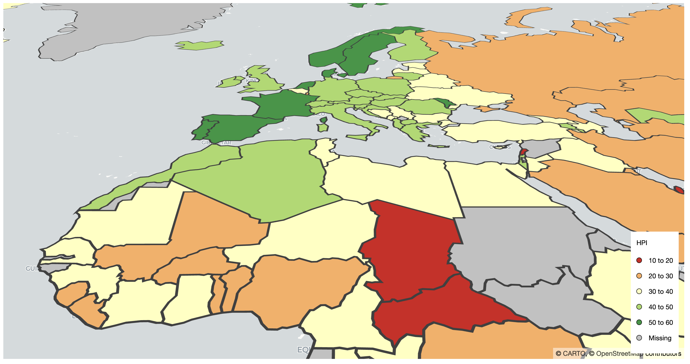
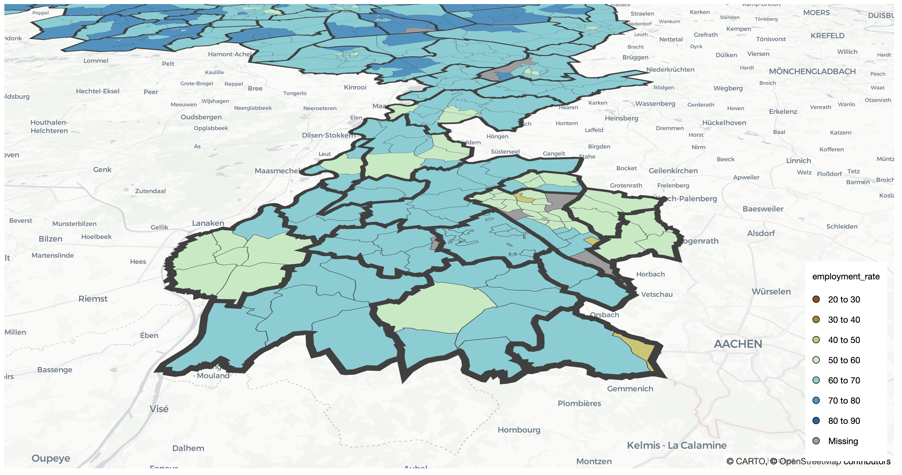

# tmap.deckgl

A new mode! tmap contains two modes: `"plot"` (static plots) and `"view"` (interactive leaflet maps).
With this package a new mode called `"deck"` is introduced. It uses the JS library DeckGL via the R package `deckgl`.

Proof of concept
-----------

The package serves as a proof of concept of the extendibility of tmap 4.

So far, only `tm_polygons` and `tm_lines` are working. Since the underlying package `deckgl` has not been updated in the last 2 years (https://github.com/crazycapivara/deckgl), further development package has low priority at the moment.


Installation
------------

```r
# install.packages("remotes")
install_github("r-tmap/tmap")
install_github("r-tmap/tmap.deckgl")
```

Example
------------


```r
library(tmap)
library(tmap.deckgl)

tmap_mode("deck")
tm_shape(World) +
  tm_polygons("HPI", fill.scale = tm_scale_intervals(values = "brewer.rd_yl_gn")) 
	
```



```
tm_shape(NLD_dist) +
	tm_polygons("employment_rate", 
				fill.scale = tm_scale_intervals(values = "scico.roma"),
				lwd = 0.1) +
tm_shape(NLD_muni) +
	tm_polygons(fill = NULL, lwd = 1) +
	tm_deck(pitch = 75)
```


